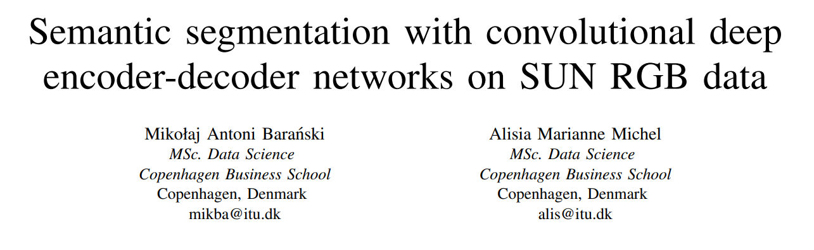
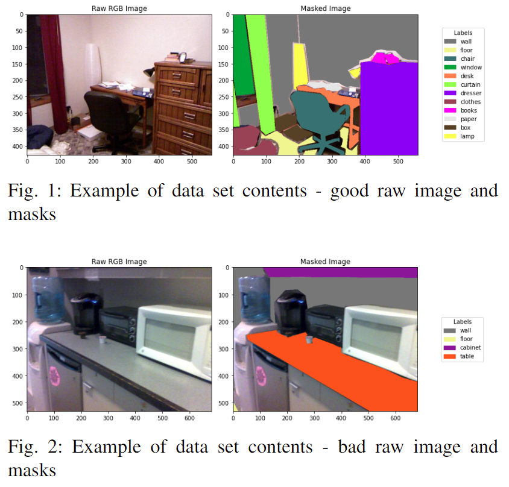
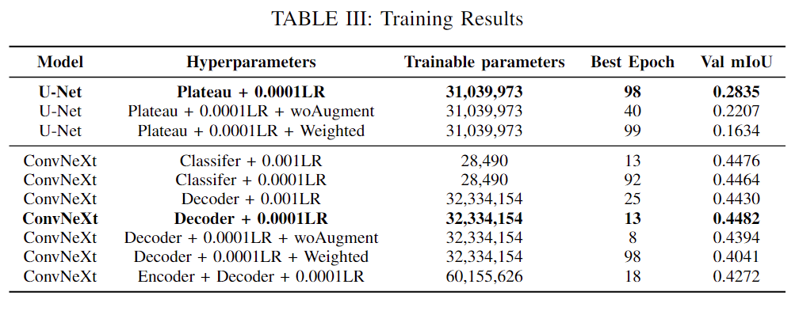
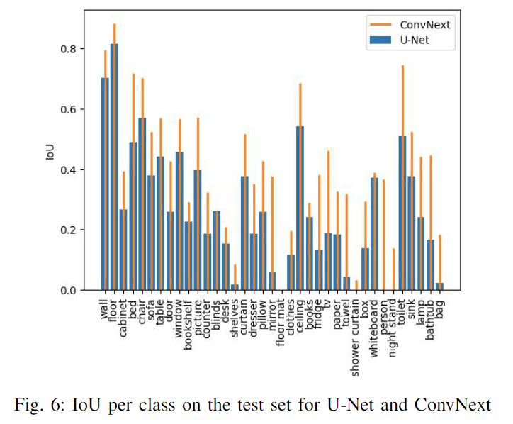

    

# Advanced Machine Learning - Image Segmentation

    

Repository contains the Final Group Project for the "Advanced Machine Learning" course at IT-University of Copenhagen. Outlines training and evaluating an object segmentation neural network tuned for indoor scene segmentation. Co-authored by Mikolaj Baranski and Alisia Michel. Key conclusions and the abstract of the report is included below, see the `final_report.pdf` for the full content of the project.

### Abstract

This paper explores the use of convolutional encoder-decoder networks to conduct semantic image segmentation on the 37 object classes in indoor scenes from the SUN RGB-D data set. The performance of a U-Net trained from scratch and a ConvNeXt pre-trained in the UPerNet method were tested with various hyperparameter settings. We investigate the impact of learning rate changes, cross-entropy loss weighting, augmentations on training data, and depths of fine-tuning (ConvNeXt only). We compare model performance by the mean Intersection over Union (mIoU) metric. Our research indicates optimal results on our data set can be achieved by fine-tuning the pre-trained ConvNeXt model on our data set including extensive image augmentations. We find optimal results are achieved when fine-tuning includes the decoder layers as well as the classifier layers. Additionally, in situations of resource limitations, only training the final classification layer provides sufficiently high mIoU. The findings of our work are limited by the size imbalance between the models (U-Net 31M & ConvNeXt 60M parameters), and the limited training capacity for models with weighted loss. Further research should explore methods of reducing the issue of class imbalance and diverse data sets.

### Data overview

### Selected results

### Conclusion

We explored the use of a U-Net trained from scratch and a fine-tuned pre-trained ConvNeXt for semantic image segmentation of the SUN RGB-D dataset. Through our hyperparameter experiments and ablation study we demonstrated the importance of applying augmentations to training data, found no performance gain from loss function weighting, and for fine-tuning observed that freezing the encoder of the model leads to improved performance. On our data set, the ConvNeXt model with a fine-tuned decoder over 13 epochs, performed best among all model setups. It achieved a mIoU of 0.430 on the test set, while the top U-Net achieved 0.278. Future work should focus on exploring more diverse training approaches such as multi-task training, which could harness the depth data available within the SUN RGB-D data and experiment with diverse training data. 